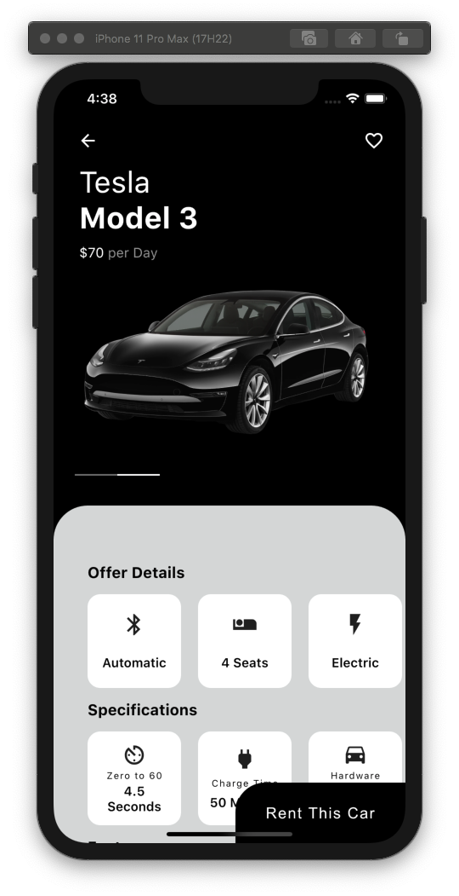
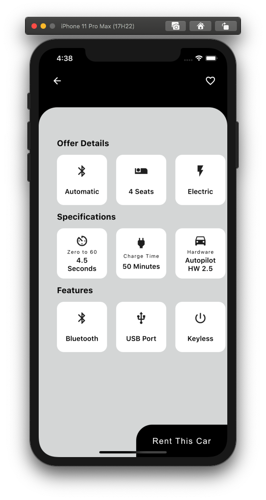

# Rent A Car Flutter Demo

This is a short tutorial project I created following the steps in https://github.com/Ronak99/RentCar-App-UI . All Credit and Information goes to @Ronak99.

  

## Demo:

  </a>
  </a>

## About:

Build this is great "rent a car" UI I created by following and understanding the tutorial provided by https://github.com/Ronak99/RentCar-App-UI

## Skills & Tools Used:

## Setup:

Go into the main project directory.

1. Run `flutter run main`
