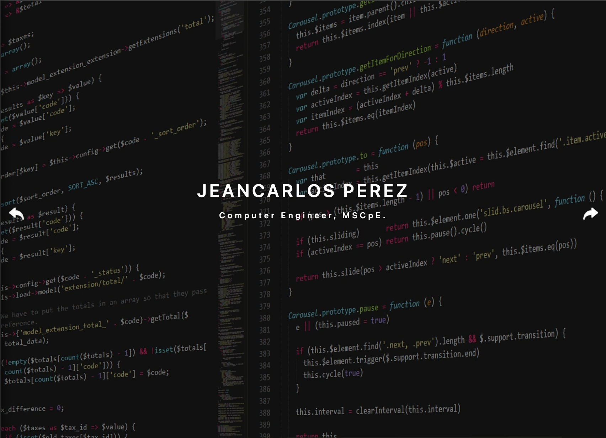
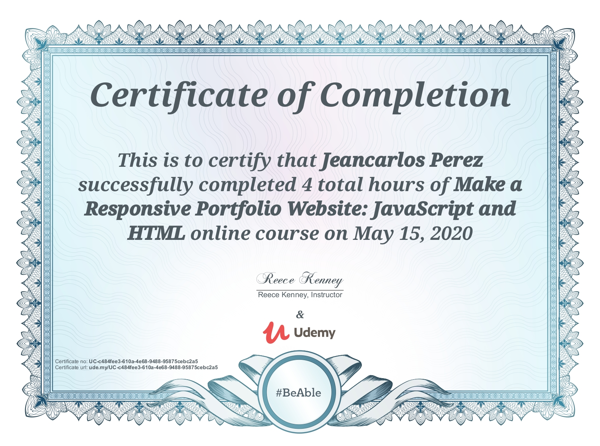

# Make a Responsive Portfolio Website Course
 This is a Udemy Course I took and followed along to build an example portfolio using jQuery, Javascript, HTML, and CSS.

   

  

## Table of contents
* [Udemy Course](#udemy-course)
* [Technologies](#about)
* [About](#skills-used)
* [Sources & References](#sources-&-references)
* [Course Certification](#udemy-certification)
* [Setup](#setup)
* [Scripts](#scripts)

## Udemy Course: 

## About:
Use JavaScript and HTML to create the ultimate responsive portfolio website from scratch!

## Skills Used:

 

 
 
 

 
  

## Udemy Certification: 

  

## Setup:
To run this project go into `1-MakeAResponsivePortfolio` and open `Index.html`.

## Sources & References:
### Media:
* Icons: https://icons8.com
* Photos: https://pexels.com
* Fonts & More: https://fontawesome.com
### Scripts:

