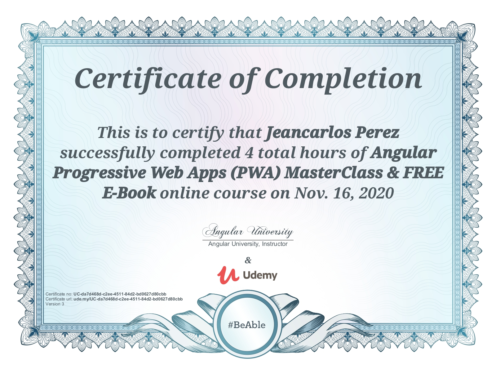

# Angular Progressive Web Applications Masterclass

This is a Udemy Course I took and followed along to build a PWA with Angular 10

   

## Table of contents

- [Udemy Course](#udemy-course)
- [About](#about)
- [Skills Used](#skills-used)
- [Course Certification](#udemy-certification)
- [Setup](#setup)
- [Sources & References](#sources-&-references)
- [Scripts](#Scripts,-APIs-&-More)

## Udemy Course:

## About:

Practical Guide to Angular Progressive Web Applications  
Code in Github repository with downloadable ZIP files per section  
Learn in detail multiple features made available by the Angular Service Worker  
Learn How to turn your Angular Application into a PWA  
Make your Angular Application Downloadable and Installable  
Make you Angular Application One-Click Installable with an App Manifest  
Add an Application Shell for boosting Initial Startup Performance  
Add Push Notifications using the Angular Service Worker  
Improve Application Performance with Application Data Caching  
Learn Service Worker Fundamentals  
Learn the Service Worker Lifecycle in Detail  
Debug Service Workers using the Chrome Dev Tools

## Skills & Tools Used:

## Udemy Certification:

  

## Setup:

Go into the project directory. You will need your own MongoDB Cluster Connection URL For this Project.

### Development server

Run `ng serve` for a dev server. Navigate to `http://localhost:4200/`. The app will automatically reload if you change any of the source files.

### Build

Run `ng build` to build the project. The build artifacts will be stored in the `dist/` directory. Use the `--prod` flag for a production build.

## Sources & References:

### Media:

- Icons: https://icons8.com
- Photos: https://pexels.com
- Fonts & More: https://fontawesome.com

### Scripts, APIs & More:
