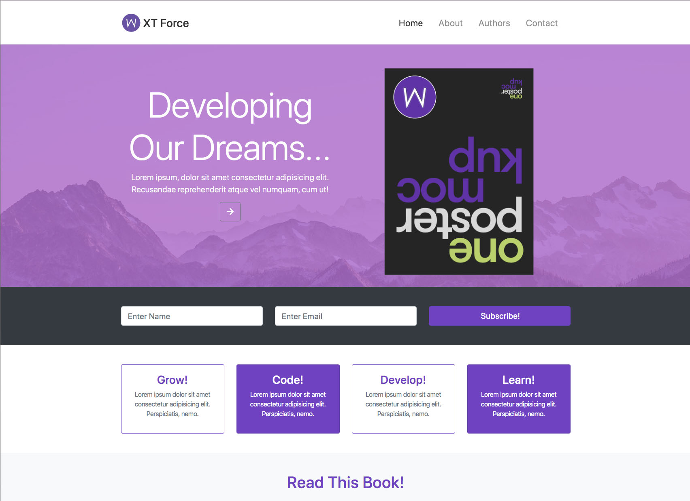
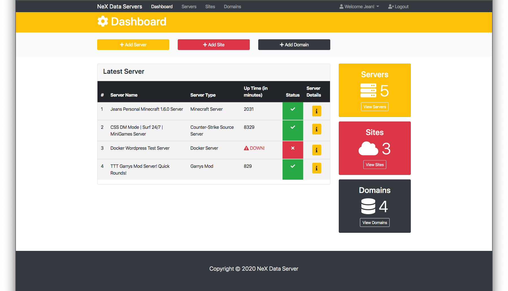
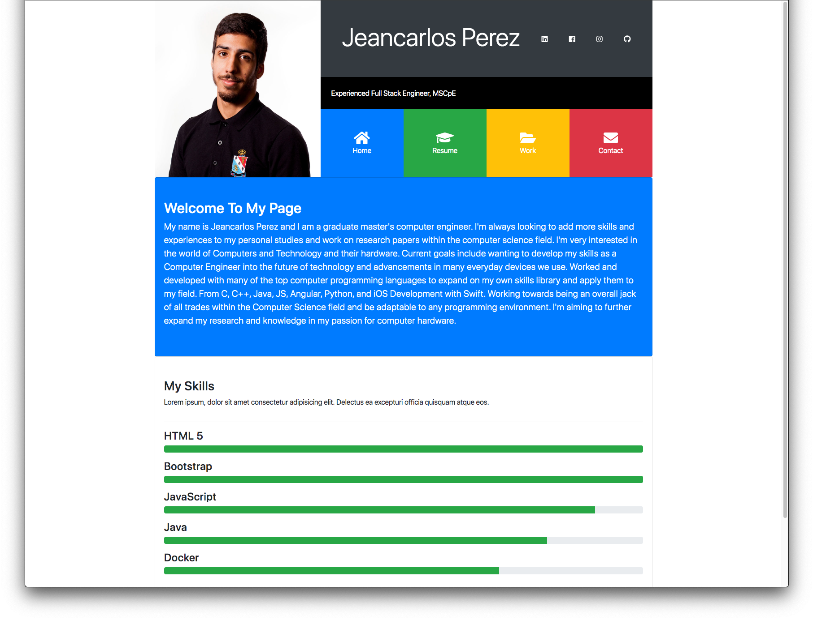

# Bootstrap 4 From Scratch Course
This is a Udemy Course I took and followed along to build an example projects using jQuery, Javascript, HTML, and of course Bootstrap 4.  

    

## Table of contents
* [Udemy Course](#udemy-course)
* [About](#about)
* [Projects](#projects)
* [Skills Used](#skills-used)
* [Sources & References](#sources-&-references)
* [Course Certification](#udemy-certification)
* [Setup](#setup)
* [Scripts](#scripts)

## Udemy Course: 

## About:
Master Bootstrap 4 and build 5 real world themes while learning HTML5 semantics & CSS3

## Projects
### Project 1 - Social Theme

### Project 2 - Book Theme

### Project 3 - Multi Page Theme

### Project 4 - Admin UI Theme

### Project 5 - Portfolio Theme

## Skills & Tools Used:

  
 
 
 

 

   

## Udemy Certification: 

  

## Setup:
To run this project go into `2-Bootstrap4FromStratch`.

## Sources & References:
### Media:
* Icons: https://icons8.com
* Photos: https://pexels.com
* Fonts & More: https://fontawesome.com
### Scripts:

